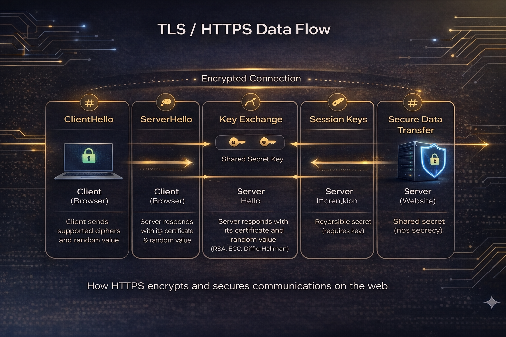

# crypto::compare 🔐

**Cryptographic algorithm decision system for engineers, architects, and technical decision-makers.**

97 algorithms. 17 categories. 97 unique linked public demos. Sourced recommendations. Safe-usage guidance. Reference architectures. Post-quantum migration context.

🌐 **[Live Site →](https://crypto-compare.systemslibrarian.dev/)**

> *So whether you eat or drink or whatever you do, do it all for the glory of God.* — 1 Corinthians 10:31

---

## What This Is

crypto::compare is a browser-based decision-support tool for choosing cryptographic algorithms responsibly.

It is designed for the point where real engineering work begins: when someone has to decide what to use for messaging, storage, authentication, signatures, or post-quantum migration, and needs something better than vague advice or a random blog post.

This project helps you:
- choose algorithms by use case rather than by hype
- compare primitives side by side using consistent fields
- understand where recommendations are strong, conditional, or uncertain
- avoid common cryptographic mistakes before they become system failures

This project does **not**:
- implement cryptographic operations
- certify systems for compliance
- replace a professional security review
- protect you from implementation bugs or operational mistakes

---

## Start Here

If you only spend 30 seconds on this repository, use this path:

1. **Need a decision fast?** Start with **If You're Building X → Use This**.
2. **Need to compare options?** Use the live comparison table and decision flowchart.
3. **Need to avoid dangerous mistakes?** Read **Common Pitfalls & Safe Usage** before touching code.



---

## Why Trust This

This project tries to earn trust in concrete ways rather than by tone alone.

| Signal | What It Means |
|--------|----------------|
| **97 algorithms across 17 categories** | Coverage is broad enough to support real design tradeoffs, not just a curated shortlist |
| **Per-algorithm provenance** | Entries are backed by standards, cryptanalysis, deployment references, and review dates |
| **5-level recommendation model** | Recommendations are not binary; they distinguish safe defaults from acceptable, legacy, research, and avoid |
| **Explicit tradeoffs** | Entries include "Why not this?", assumptions, and "When this changes" conditions |
| **Validation and tests** | Dataset validation is enforced with Zod and covered by a substantial automated test suite |
| **Static architecture** | No backend, no accounts, no telemetry, no hidden recommendation engine |

Trust still has limits here:

- recommendation quality is only as good as the underlying sources and review freshness
- implementation safety still depends on the library and the surrounding system design
- there is no institutional backing, external audit, or guaranteed update cadence

### Freshness Snapshot

- provenance entries currently carry review dates spanning **2026-04-18** through **2026-04-18**
- each algorithm record includes a `lastReviewed` value in the dataset provenance
- recommendation confidence should drop as that review window gets older relative to new cryptanalysis, standards work, or deployment changes

---

## If You're Building X → Use This

These are conservative defaults, not universal laws. They are meant to get a capable engineer onto safe ground quickly.

| Building | Recommended Stack | Why It Works | Real-World Pattern | Avoid This | When It Changes |
|----------|-------------------|--------------|--------------------|------------|-----------------|
| **Secure Messaging** | XChaCha20-Poly1305 + X25519/ML-KEM-768 hybrid + HKDF ratchet + strong identity signatures | AEAD for confidentiality and integrity, hybrid exchange for forward secrecy plus PQ transition, ratcheting for compartmentalization | Signal-style designs, PQXDH-style migration, modern end-to-end messaging | Static RSA, no ratchet, random-nonce AES-GCM at very high message volume without discipline | Shift more fully to PQ components as ecosystem support matures |
| **Password Storage / Authentication** | Argon2id with strong memory cost, unique salt, TLS in transit | Memory-hard password hashing raises attacker cost materially after database compromise | Modern password storage guidance, password managers, current OWASP direction | MD5, SHA-1, SHA-256 alone, unsalted hashes, low-cost PBKDF2 for new systems | Tune parameters upward as commodity hardware improves |
| **File Encryption at Rest** | AES-256-GCM where hardware acceleration exists, otherwise XChaCha20-Poly1305; HKDF for key separation | AEAD prevents silent tampering; per-file derivation limits blast radius | Full-disk encryption, backup encryption, encrypted archives | ECB, CBC without authentication, nonce reuse, same key for every purpose | Add PQ wrapping when long-term confidentiality matters |
| **API / Web Encryption** | TLS 1.3 with AES-256-GCM or ChaCha20-Poly1305; X25519 with hybrid PQ where available | Removes legacy negotiation problems, provides forward secrecy, aligns with modern transport security practice | HTTPS, service-to-service APIs, gRPC over TLS | TLS 1.0/1.1, RSA key exchange, skipping certificate validation | Certificate and KEM choices change as PQ standards land in mainstream PKI |
| **Long-Term Sensitive Data** | ML-KEM-1024 + AES-256 + conservative signature choice such as SLH-DSA for archival cases | Designed for data that may need to survive the classical-to-PQ transition | Government, medical, legal, and archival confidentiality planning | Waiting for a "perfect" migration moment, assuming RSA/ECC is fine for multi-decade secrecy | Reassess if PQ cryptanalysis materially changes confidence in current assumptions |
| **Digital Signatures** | ML-DSA for PQ planning; Ed25519 for classical deployments where appropriate | Clear modern defaults with strong ecosystems and fewer operational traps than older options | Software signing, document signing, API auth, commit signing | RSA-1024, legacy DSA, fragile ECDSA deployments with poor nonce handling | Toolchain and compliance requirements may force different choices in regulated environments |

The live tool expands these with detailed stacks, rationale, tradeoffs, and links into specific algorithms.

---

## Crypto Reality

Cryptographic algorithms are **public standards and published constructions**, not secret sauce. AES, SHA-256, HKDF, ML-KEM, and ML-DSA are secure because they have been studied, attacked, formalized, debated, and deployed in the open.

That also means algorithm choice is only part of the problem.

Most real-world failures happen in implementation and operations:
- nonce reuse
- broken key management
- skipped certificate validation
- side channels
- unsafe defaults
- custom code where a vetted library should have been used

**Do not write your own cryptographic primitives.**

Use established libraries. Treat algorithm selection and implementation quality as separate decisions that both matter.

---

## Common Pitfalls & Safe Usage

This section is intentionally direct because crypto mistakes fail hard.

### Critical Rules

| Rule | Why It Matters |
|------|----------------|
| **Never reuse a nonce** with AES-GCM or ChaCha20-Poly1305 | Reuse can destroy confidentiality and authenticity guarantees |
| **Never encrypt without authentication** | Confidentiality without integrity gives attackers room to manipulate ciphertext |
| **Never use fast general-purpose hashes for passwords** | Password storage needs memory-hard functions like Argon2id, not SHA-256 |
| **Never use ECB mode** | It leaks structural information about plaintext |
| **Never hard-code secrets** | Keys in source control or build pipelines eventually leak |
| **Never roll your own crypto** | Custom primitives and protocols fail in ways that are difficult to detect |
| **Never disable certificate verification** | That turns TLS into theater |

### Key Management Basics

- generate keys with a CSPRNG, never a general-purpose PRNG
- separate keys by purpose: encryption, MAC, signing, and derivation keys should not be interchangeable
- rotate long-lived keys on an explicit policy rather than ad hoc intuition
- keep secrets in hardware-backed stores or dedicated secret-management systems where possible
- plan for compromise: revocation, re-issuance, and blast-radius reduction matter as much as initial generation

### What This Tool Does Not Protect Against

- timing leaks, memory-safety bugs, and side-channel vulnerabilities
- bad protocol composition
- poor secrets handling and weak operational controls
- unsafe framework defaults or insecure deployment configuration

Choosing the right primitive helps. It does not make the surrounding system safe by itself.

---

## Recommended Libraries

Algorithm safety depends heavily on implementation quality. If your codebase touches cryptography directly, prefer mature libraries with strong operational history.

| Category | Primary Direction | Common Options |
|----------|-------------------|----------------|
| **General-purpose application crypto** | libsodium | NaCl-family bindings across major languages |
| **TLS and transport security** | BoringSSL or OpenSSL 3.x | Also language-native TLS stacks built on vetted primitives |
| **Rust systems** | ring plus rustls where appropriate | Use ecosystem-native wrappers instead of raw bindings where practical |
| **Post-quantum experimentation and integration** | liboqs and PQClean-derived wrappers | For evaluation and early integration, not blind production use |
| **Browser crypto** | Web Crypto API | Use native browser primitives rather than hand-rolled JavaScript |
| **Go services** | `crypto/*` and `x/crypto` | Prefer standard-library and official extensions |
| **JVM / .NET ecosystems** | Bouncy Castle where needed | Especially when broader algorithm coverage is required |

### Why These Libraries

| Library | Why It Is Trusted | Seen In |
|---------|-------------------|---------|
| **libsodium** | Misuse-resistant API design and broad language support | Modern application crypto, sealed boxes, message encryption |
| **BoringSSL** | Hardened operational pedigree and large-scale deployment | Chrome, Android, large internet-facing systems |
| **OpenSSL 3.x** | Deep ecosystem penetration and compliance relevance | Servers, appliances, enterprise deployments |
| **ring** | Minimalist surface area and strong Rust adoption | Rust TLS and security-sensitive infrastructure |
| **liboqs** | Tracks mainstream PQ standardization work closely | PQ evaluation and migration prototypes |
| **Web Crypto API** | Native browser implementation path | Web apps that need client-side cryptography |

The right pattern is usually: **choose a sound algorithm here, then implement it through one of these libraries instead of custom code.**

---

## Reference Architectures

These are not complete protocols. They are system-level reference patterns that show how the primitives fit together.

### Secure Messaging

```text
Identity Keys → Hybrid Session Setup → HKDF / Ratchet → AEAD Message Encryption → Transcript / State Binding
```

- **Stack:** identity signatures, hybrid key establishment, HKDF-derived message keys, AEAD for messages
- **Security properties:** confidentiality, forward secrecy, compartmentalization, authenticated peer identity

### Web API / TLS-Style Transport

```text
ClientHello → Certificate Validation → Ephemeral Key Agreement → Session Keys → AEAD Records
```

- **Stack:** TLS 1.3, ephemeral key agreement, AEAD record protection, authenticated certificates
- **Security properties:** confidentiality, integrity, server authentication, replay resistance, forward secrecy

### File Encryption System

```text
Passphrase or Master Key → Strong KDF → Per-File Key → AEAD Encryption → Store Ciphertext + Metadata
```

- **Stack:** Argon2id or master-key input, HKDF-style separation, AES-256-GCM or XChaCha20-Poly1305
- **Security properties:** confidentiality, integrity, limited blast radius, portability of encrypted artifacts

### Authentication System

```text
Password → Argon2id → Stored Hash + Salt + Parameters → TLS-Protected Login → Constant-Time Verification
```

- **Stack:** Argon2id, per-user salt, TLS transport, constant-time comparison, controlled session issuance
- **Security properties:** brute-force resistance after breach, safe verification flow, transport confidentiality

These flows are intentionally simple enough to teach and strong enough to guide architecture discussions.

---

## Design Philosophy & Trust Model

### Purpose

This project exists to support engineering judgment, not replace it.

The goal is to help a reader move from "I know crypto matters" to "I can defend this algorithm choice in an architecture review." That is a different goal from implementing libraries, publishing new research, or certifying production systems.

### Conservative Recommendation Philosophy

- prefer algorithms with strong public analysis and meaningful deployment history
- prefer safe defaults over novelty
- treat post-quantum migration as a real planning problem, not marketing language
- show uncertainty explicitly instead of burying it behind a recommendation label

### How Recommendation Levels Work

| Level | Meaning |
|-------|---------|
| **Recommended** | Strong default for new systems in the stated context |
| **Acceptable** | Reasonable in bounded scenarios, compatibility needs, or transitional environments |
| **Legacy** | Still encountered, but not the direction to choose for new systems |
| **Research** | Interesting, promising, or relevant, but not a safe default for ordinary deployment |
| **Avoid** | Unsafe, obsolete, or too failure-prone for responsible new use |

Recommendation levels are based on a combination of:
- public standardization status
- maturity of cryptanalysis
- deployment experience
- implementation ecosystem quality
- misuse risk in ordinary engineering contexts
- relevance to current classical and post-quantum threat models

### Transparency by Design

Each algorithm entry is expected to answer more than "what is it?"

It should also answer:
- **Why would I choose it?**
- **Why would I avoid it?**
- **What assumptions am I making?**
- **What would make this recommendation change later?**

That is why the dataset includes recommendation rationale, assumptions, tradeoffs, estimation methodology, and provenance instead of just names and key sizes.

### Data Sources

The project is grounded in:
- NIST FIPS and SP 800 publications
- IETF RFCs
- ISO and national standards where relevant
- academic papers and cryptanalysis literature
- deployment evidence from major protocol and library ecosystems

See [docs/data-sources.md](/workspaces/crypto-compare/docs/data-sources.md) and [src/data/provenance.ts](/workspaces/crypto-compare/src/data/provenance.ts) for the source backbone.

### Where Reasonable Experts May Disagree

Some choices in cryptography are not pure right-or-wrong decisions. They are judgment calls under changing constraints.

Common examples:
- **how aggressively to push post-quantum migration today** for systems with different risk horizons and compatibility budgets
- **Ed25519 vs ECDSA P-256** in environments where deployment simplicity and regulatory expectations pull in different directions
- **ML-DSA vs more conservative hash-based signatures** when long-term confidence matters more than size or speed
- **Groth16 vs PLONK vs zk-STARKs** when proof size, trusted setup assumptions, prover cost, and transparency matter differently

The project takes a conservative view, but it is explicit that some recommendation boundaries are matters of engineering judgment rather than timeless truth.

### Honest Limitations

- this is not an implementation guide down to API calls and safe parameter handling in every language
- this is not a compliance mapping tool
- this is not a live feed of vulnerabilities, audits, or ecosystem incidents
- this is not guaranteed current forever; review freshness matters
- this is still a solo-maintained project

That honesty is part of the trust model, not a weakness in spite of it.

---

## What You Can Do In The App

| Capability | What It Gives You |
|-----------|--------------------|
| **Browse by category** | 97 algorithms across elliptic curves, encryption, KEM, signatures, hashing, password hashing, ZKPs, MPC, OT/PIR, threshold signatures, and more |
| **Compare side by side** | Consistent field-by-field comparisons adapted to category-specific metrics |
| **Use the decision flowchart** | A guided path from problem statement to algorithm recommendation |
| **Download justification reports** | Markdown output for architecture reviews and design discussion |
| **Filter and sort** | PQ-safe, standards-track, NIST status, deployment, origin, size, and security dimensions |
| **Review hybrid patterns** | Classical-plus-PQ constructions for practical migration planning |
| **Explore linked demo projects** | 97 unique linked public demos across the mapped categories, with per-category project context in the explainer panels |
| **Read safety and architecture guidance** | Use-case content, pitfalls, library direction, and system-level flows |

### Coverage Snapshot

| Category | Examples |
|----------|----------|
| CSPRNG | CSPRNG (OS), ChaCha20-based DRBG |
| Symmetric Encryption | AES-256-GCM, ChaCha20-Poly1305, XChaCha20-Poly1305 |
| Hashing | SHA-2, SHA-3, BLAKE2b, BLAKE3 |
| MAC | HMAC-SHA-256, CMAC-AES, KMAC-256 |
| KDF | HKDF, Argon2-KDF |
| Password Hashing | Argon2id, bcrypt, scrypt, PBKDF2 |
| Asymmetric Encryption | RSA-OAEP, ECIES |
| KEM | ML-KEM, HQC, Classic McEliece, FrodoKEM |
| Signatures | ML-DSA, FALCON, SLH-DSA, XMSS |
| Threshold Signatures | FROST, GG20 |
| Secret Sharing | Shamir, Feldman VSS, Additive |
| Homomorphic Encryption | TFHE, CKKS, BGV |
| ZKP | Groth16, zk-STARKs, PLONK |
| MPC | SPDZ, ABY, Garbled Circuits |
| OT / PIR | OT, SimplePIR, SealPIR |
| Steganography | LSB, DCT, Spread Spectrum |

---

## Tech Stack

| Layer | Technology |
|-------|-----------|
| Framework | Next.js 14 static export |
| Language | TypeScript in strict mode |
| Validation | Zod-based dataset validation |
| Testing | Vitest + Testing Library |
| Styling | Tailwind CSS |
| Deployment | GitHub Pages |

No backend. No accounts. No cookies. No analytics.

### Accessibility and Responsiveness

The app includes semantic landmarks, ARIA states and labels, keyboard navigation, focus-visible support, reduced-motion handling, touch-friendly controls, and mobile layouts for smaller screens.

---

## Getting Started

```bash
git clone https://github.com/systemslibrarian/crypto-compare.git
cd crypto-compare
npm install
npm run dev
```

Open <http://localhost:3000>.

| Command | Purpose |
|---------|---------|
| `npm run dev` | Start the local development server |
| `npm run build` | Build the static export |
| `npm run test` | Run the automated test suite |
| `npm run test:demos` | Run demo-sync and demo-resource integrity tests |
| `npm run type-check` | Run the TypeScript checker |
| `npm run lint` | Run linting |
| `npm run check:demos` | Compare local demo mappings to the live crypto-lab catalog |
| `npm run check:demos:json` | Output demo sync report as JSON for automation |
| `npm run check:demos:report` | Write demo sync JSON report to demo-sync-report.json |
| `npm run validate:full` | Run dataset validation plus strict live demo sync check |

Offline audit option:
Run `npx tsx scripts/check-demo-sync.ts --live-html-path=/tmp/crypto-lab.html --strict` to compare against a saved catalog snapshot.
Advanced options:
Use `--timeout-ms=<n>` and `--max-retries=<n>` to tune network behavior for constrained CI or unreliable connections.
Use `--help` to print all available flags.

---

## Project Structure

```text
src/
├── app/                      # routes and layout
├── components/               # UI, decision guides, architectures, safety content
├── data/                     # algorithm dataset, categories, hybrid patterns, provenance
├── lib/                      # comparison logic, validation, keyboard shortcuts
├── types/                    # strict TypeScript data models
└── __tests__/                # behavioral and dataset tests
```

High-value files:

- [src/components/CryptoCompare.tsx](/workspaces/crypto-compare/src/components/CryptoCompare.tsx)
- [src/components/DecisionFlowchart.tsx](/workspaces/crypto-compare/src/components/DecisionFlowchart.tsx)
- [src/components/UseCaseGuide.tsx](/workspaces/crypto-compare/src/components/UseCaseGuide.tsx)
- [src/components/SafeUsage.tsx](/workspaces/crypto-compare/src/components/SafeUsage.tsx)
- [src/components/ReferenceArchitectures.tsx](/workspaces/crypto-compare/src/components/ReferenceArchitectures.tsx)
- [src/components/DesignPhilosophy.tsx](/workspaces/crypto-compare/src/components/DesignPhilosophy.tsx)
- [src/data/algorithms.ts](/workspaces/crypto-compare/src/data/algorithms.ts)
- [src/data/provenance.ts](/workspaces/crypto-compare/src/data/provenance.ts)

---

## Related Projects

Each category in the app links to working demo projects that illustrate the cryptographic concepts in practice.

- Full live crypto-lab index: [crypto-lab.systemslibrarian.dev/crypto-lab](https://crypto-lab.systemslibrarian.dev/crypto-lab/)
- App mapping source of truth: [src/data/demoResources.ts](/workspaces/crypto-compare/src/data/demoResources.ts)
- Current mapped crypto-lab demos: **97** unique slugs (kept in sync with the live crypto-lab catalog)

The list below is representative rather than exhaustive.

| Project | Focus |
|---------|-------|
| [Quantum Vault KPQC](https://github.com/systemslibrarian/crypto-lab-quantum-vault-kpqc) | Symmetric crypto, KEM, signatures, KDF, MAC, secret sharing, CSPRNG |
| [Blind Oracle](https://github.com/systemslibrarian/crypto-lab-blind-oracle) | Fully homomorphic encryption (TFHE) |
| [Silent Tally](https://github.com/systemslibrarian/crypto-lab-silent-tally) | Secure multi-party computation |
| [FROST Threshold](https://github.com/systemslibrarian/crypto-lab-frost-threshold) | Threshold signatures (FROST / Ed25519) |
| [Patron Shield](https://github.com/systemslibrarian/crypto-lab-patron-shield) | Private information retrieval (PIR) |
| [Iron Letter](https://github.com/systemslibrarian/crypto-lab-iron-letter) | Asymmetric / public-key encryption (ECIES, RSA-OAEP) |
| [Shadow Vault](https://github.com/systemslibrarian/crypto-lab-shadow-vault) | Deniable symmetric encryption (ChaCha20-Poly1305) |
| [Dad Mode Morse](https://github.com/systemslibrarian/dad-mode-morse2) | Symmetric encryption + digital signatures |
| [Corrupted Oracle](https://github.com/systemslibrarian/crypto-lab-corrupted-oracle) | CSPRNG backdoor demonstration (Dual_EC_DRBG) |
| [ZK Proof Lab](https://github.com/systemslibrarian/crypto-lab-zk-proof-lab) | Zero-knowledge proof systems |
| [Phantom Vault](https://github.com/systemslibrarian/crypto-lab-phantom-vault) | Stateless password manager (PBKDF2 + HMAC-DRBG) |
| [snow2](https://github.com/systemslibrarian/snow2) | Steganography / covert channels |
| [Hybrid Wire](https://github.com/systemslibrarian/crypto-lab-hybrid-wire) | Hybrid post-quantum key exchange (X25519 + ML-KEM-768) |
| [Kyber Vault](https://github.com/systemslibrarian/crypto-lab-kyber-vault) | ML-KEM (CRYSTALS-Kyber) key encapsulation — NIST FIPS 203 |
| [Dilithium Seal](https://github.com/systemslibrarian/crypto-lab-dilithium-seal) | ML-DSA (CRYSTALS-Dilithium) post-quantum signatures — NIST FIPS 204 |
| [SPHINCS+ Ledger](https://github.com/systemslibrarian/crypto-lab-sphincs-ledger) | SLH-DSA (SPHINCS+) hash-based PQ signatures — NIST FIPS 205 |
| [Ratchet Wire](https://github.com/systemslibrarian/crypto-lab-ratchet-wire) | Double Ratchet Algorithm (Signal protocol) |
| [Shamir Gate](https://github.com/systemslibrarian/crypto-lab-shamir-gate) | Shamir's Secret Sharing with polynomial visualization |
| [Iron Serpent](https://github.com/systemslibrarian/crypto-lab-iron-serpent) | Serpent-256 block cipher (AES finalist) |
| [Dead Sea Cipher](https://github.com/systemslibrarian/crypto-lab-dead-sea-cipher) | Cryptographic history — Atbash to AES-256-GCM |
| [Biham Lens](https://github.com/systemslibrarian/crypto-lab-biham-lens) | Differential cryptanalysis (Biham & Shamir, DES) |
| [AES Modes](https://github.com/systemslibrarian/crypto-lab-aes-modes) | AES modes comparison — ECB, CBC, CTR, GCM, CCM with attacks |
| [Format Ward](https://github.com/systemslibrarian/crypto-lab-format-ward) | Format-preserving encryption (FF1, FF3-1) |
| [Padding Oracle](https://github.com/systemslibrarian/crypto-lab-padding-oracle) | CBC padding oracle attack (Vaudenay 2002) |
| [Timing Oracle](https://github.com/systemslibrarian/crypto-lab-timing-oracle) | Timing side-channel attacks and constant-time defenses |
| [Curve Lens](https://github.com/systemslibrarian/crypto-lab-curve-lens) | Elliptic curve explorer — point arithmetic, ECDH |
| [X3DH Wire](https://github.com/systemslibrarian/crypto-lab-x3dh-wire) | X3DH asynchronous key agreement (Signal handshake) |
| [BIKE Vault](https://github.com/systemslibrarian/crypto-lab-bike-vault) | BIKE code-based post-quantum KEM |
| [McEliece Gate](https://github.com/systemslibrarian/crypto-lab-mceliece-gate) | Classic McEliece — oldest post-quantum KEM (1978) |
| [HQC Vault](https://github.com/systemslibrarian/crypto-lab-hqc-vault) | HQC Hamming Quasi-Cyclic post-quantum KEM |
| [Noise Pipe](https://github.com/systemslibrarian/crypto-lab-noise-pipe) | Noise Protocol Framework — handshake patterns + WireGuard |
| [Falcon Seal](https://github.com/systemslibrarian/crypto-lab-falcon-seal) | Falcon NTRU lattice signatures (NIST alternate) |
| [Babel Hash](https://github.com/systemslibrarian/crypto-lab-babel-hash) | Hash functions — SHA-256, SHA3-256, BLAKE3 with attacks |
| [KDF Chain](https://github.com/systemslibrarian/crypto-lab-kdf-chain) | KDF comparison — HKDF, PBKDF2, scrypt, Argon2id |
| [MAC Race](https://github.com/systemslibrarian/crypto-lab-mac-race) | MAC comparison — HMAC, CMAC, Poly1305, GHASH |
| [RSA Forge](https://github.com/systemslibrarian/crypto-lab-rsa-forge) | RSA demo — textbook, OAEP, PSS, live attacks |
| [Meow Decoder](https://github.com/systemslibrarian/meow-decoder) | Secure optical air-gap file transfer via QR-code GIFs |

---

## Contributing

See [CONTRIBUTING.md](/workspaces/crypto-compare/CONTRIBUTING.md).

---

[GitHub: systemslibrarian](https://github.com/systemslibrarian)

---

## License

MIT
